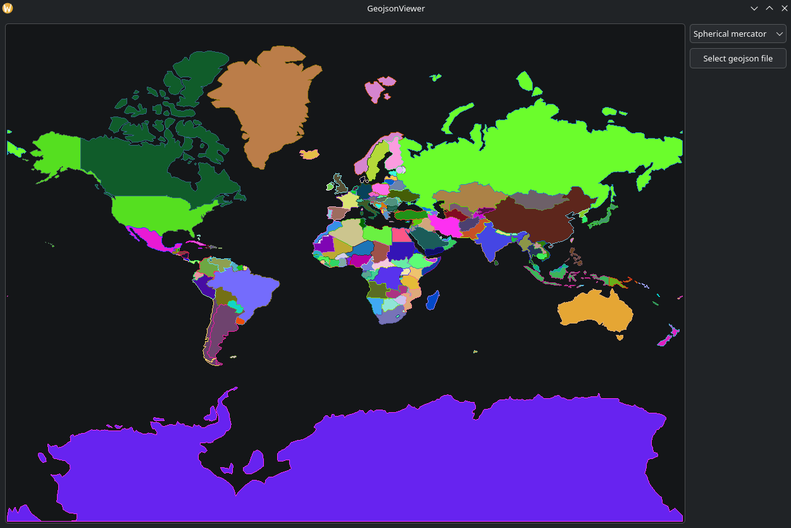

# LatteLong

Crossplatform geographic Qt6 library.



[Check out Examples](tests/)

## Installation 
```bash
mkdir build
cd build
cmake .. -DBUILD_SHARED_LIBS=ON
sudo cmake --build . -j 4 --config Release --target install
```
now you will be able to access library with CMake:
```cmake
find_package(LatteLong)
target_link_libraries(YourProject LatteLong::LatteLong)
```

OR you can pass installation and use library simply by adding this directory with cmake:
```cmake
add_subdirectory(./LatteLong)
```